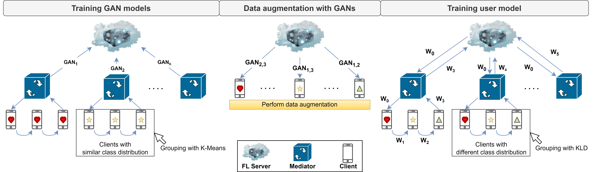
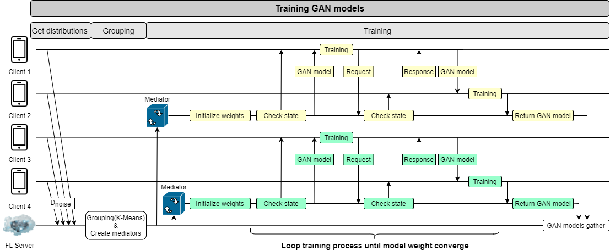
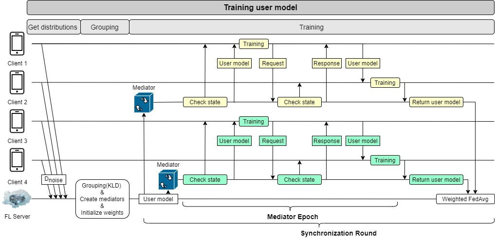

# GANDALF
Federated Learning (FL) is a distributed learning technique that allows devices to
collaboratively learn a shared prediction model while keeping all the training data
locally and thus enable more secured and accurate model training. However, the
convergence and accuracy of federated learning can be degraded by the non-IID
(non independent and identically distributed) data across all edge devices. Hence,
we proposed **a GAN-based Data Augmentation Learning Framework named GANDALF**, which aims to solve the non-IID problem by performing data augmentation
with GAN models based on a mediator-based system architecture

# Overview
The overview of the proposed framework is shown in below figure. This framework consists of three phases: 
Training GAN models, Data augmentation with GANs, and Training user model. In addition, our framework also introduces the mediator-based architecture, which brings optimizations and reduces overhead. 
The detail of the framework and mediator-based architecture are discussed below.



- Training GAN models
  - In this phase, we train multiple GAN models. At first, the clients with similar class distribution are grouped into the same group based on a clustering algorithm, and each group will be assigned a mediator. Next, each group trains a GAN model independently in parallel. In each group, the GAN model weight is passed between the clients and updated sequentially until it converges. Mediators in this phase are responsible for scheduling the training process of each group and returning the converged GAN model to the server.
- Data augmentation with GANs
  - In this phase, each client performs data augmentation with GAN models. After the first phase, the server already has multiple trained GAN models. Next, the server sends the appropriate GAN models to each client according to its class distribution. Then, each client performs data augmentation with received GAN models to replenish the minority classes. Considering the computation cost of data generation and randomness of GAN data augmentation, we design an algorithm used to calculate the amount of data that each received GAN model should generate to minimize the computation cost. Furthermore, we also combine GAN data augmentation with static data augmentation to handle the randomness of GAN data augmentation.
- Training user model
  - We train the model which solves the main task here. At first, we perform grouping, which makes the class distribution of each group as close to uniform as possible. Then each group will be assigned a mediator. Next, the server initializes the global model and broadcasts it to all mediators. After that, each group updates the received model weight independently in parallel. In each group, the model weight is passed between the clients and updated sequentially. Finally, the server aggregates the updated model weight of all mediators, performs weighted FedAvg, and updates the global model. Then the server broadcast the global model to all mediators again to start the next round of training. After several training rounds, we get a well-trained model at the end.
# Implementation

1. Data generation
    1. All data generation operations are implemented under ../GANDALF/data_generation
    2. Modify the config.py and set the path used to store the local datasets and the way splitting datasets
        1. For example, to generate local dataset with cinic10, just uncomment the parameter setting for cinic10 and comment out the parameter setting for emnist
        2. You can also change the path store the local datasets
        3. The parameter ***mode*** can be one of the options
            1. evaluation: just for normal evaluation as paper describe
            2. one_class, two_class, four_class: for n-class non-IID problem
    3. Besides generating local datasets, you can also call the function ***generate_shared_dataset*** to generate the globally shared dataset which used to reproduce the experiments of Data-sharing strategy, one of the baselines.
    
        ```bash
        python main.py // in data_generation
        ```
    
2. NATS
    1. All communication operations between clients, mediators, and the server are based on message queue(nats). Follow the instruction of the [doc](https://docs.nats.io/running-a-nats-service/introduction/installation) to install NATS
    2. To activate the nats server, execute the below command with nats.config, which sets suitable message size limit and pending threshold.
        
        ```bash
        nats-server --config nats.config
        ```
        
3. Training GAN models
    1. This section refers to the first phase of GANDALF. The flow chart of the training process is indicated as a following graph. The implementation is under ../GANDALF/nats-GAN
        
        
        
    2. In config.py, there are several hyperparameters you should notice and set properly
        1. Dataset you perform training with, different dataset have different channel size.
        2. Hyperparameter of local training and federated learning
        3. Differential privacy setting for model weights and local data distributions
        4. Path of local datasets and trained GAN models
            1. Path of local datasets should be same as the path of data generation
    3. To begin training, you should activate nats-server first. Them perform the below three command with tmux sequentially.
        1. Here, we launch one server, multiple mediator and clients based on number of mediator and the number of clients we set.
        2. The number of GPU the training uses is equal to the number of mediators. So must ensure the number of available GPU is enough or the process will crushed.
        
        ```bash
        python server.py
        python mediator.py && python mediator .... // depends on how many mediator you set
        python client.py && python client.py ... // depends on how many client you set
        ```
        
    4. The flow of function call of each component is listed as follow
        1. Client
            1. request_id_cb
                1. Request the server for an ID, the ID will be used to assign local datasets
            2. request_datainfo_cb
                1. Clients send local data distributions to the server, which are used to group
            3. request_check_network_cb
                1. Mediator send a message to check whether the client is available
                2. In the experiment of Fault tolerance, there are random node failure
            4. train_cb
                1. Perform local training
                2. After training, send a message to the mediator to check which client is the next one to perform training. Then send the model to it
            5. request_pass_weight_cb
                1. If the mediator request the client send the model to a client, apply differential privacy to the model weight, and send the model to the next client
                2. If the mediator request the client send the model to the mediator, send the model to the mediator. Then wait for the termination
            6. The step 3~5 are iteratively performed until the model converge or the number of round exceed the threshold
            7. terminate_cb
                1. Receive the termination message from the mediator, terminate itself
        2. Mediator
            1. request_id_cb
                1. Request the server for an ID, the ID will be used to perform grouping
            2. request_groupinfo_cb
                1. Request the server for the group information periodically
            3. choose_first_client
                1. After receiving group information, each mediator start training
                2. This function initialize the model weight and choose a client which is the first one to perform local training
            4. request_pass_weight_cb → choose_next_client
                1. A client has finished the local training, select the next one client and send the information to the client which finished training
            5. The step 4 is iteratively performed until the model converge or the number of round exceed the threshold.
            6. save_weight_cb
                1. Receive the model weight from a client and store the GAN model in the path you specify
            7. terminate_process
                1. After storing, request clients for the termination
                2. Send a message to the server for notification
                3. Terminate itself
        3. Server
            1. request_id_cb
                1. Receive the requests from clients, return ID sequentially to the clients.
            2. request_datainfo_cb
                1. Receive the local data distributions of clients. Then group the clients with similar data distribution into the same group.
            3. request_groupinfo_cb
                1. After grouping, broadcast the group information to the mediators.
            4. work_done_cb
                1. Ensure all mediator finish the job first, then terminate itself.
4. Training User models
    1. This section refers the second and third phase of GANDALF. The flow chart of the training process is indicated as a following graph. The implementation is under ../GANDALF/nats-Resnet.
        
        
        
    2. In config.py, there are several hyperparameters you should notice and set properly
        1. Dataset you perform training with, different dataset have different channel size and number of classes
        2. The augmentation methods
            1. gan_augmentation: use GAN models to generated fake data
            2. static_augmentation: use static data augmentation to support gan_augmentation
            3. only_static_data_augmentation: apply only static data augmentation
            4. shared_augmentation: use globally shared dataset to augment local datasets
            5. replace_fake_with_real: use real data to replace the fake data generated by GAN models
        3. Hyperparameter of local training and federated learning
        4. Differential privacy setting for model weights and local data distributions
        5. Path of local datasets and different kinds of augmented datasets
    3. To begin training, you should activate nats-server first. Them perform the below three command with tmux sequentially.
        1. Here, we launch one server, multiple mediator and clients based on number of mediator and the number of clients we set.
        2. The number of GPU the training uses can be set in the config.py. It is different with that in the implementation of the first phase.
        
        ```bash
        python server.py
        python mediator.py && python mediator .... // depends on how many mediator you set
        python client.py && python client.py ... // depends on how many client you set
        ```
        
    4. The flow of function call of each component is listed as follow
        1. Client
            1. request_id_cb
                1. Request the server for an ID, the ID will be used to assign local datasets
            2. request_gan_weight_cb
                1. Request the server for the GAN model weights
                2. After receiving the GAN models, perform data augmentation with the strategy which is specified in the config.py
                3. After data augmentation, client sent the information of augmented dataset to the server
            3. request_check_network_cb
                1. Mediator send a message to check whether the client is available
                2. In the experiment of Fault tolerance, there are random node failure
            4. train_cb
                1. Perform local training
                2. After training, send a message to the mediator to check which client is the next one to perform training. Then send the model to it
            5. request_pass_weight_cb
                1. If the mediator request the client send the model to a client, apply differential privacy to the model weight, and send the model to the next client
                2. If the mediator request the client send the model to the mediator, send the model to the mediator.
            6. The step 3~5 are iteratively performed until the mediator epoch achieve preset value
            7. terminate_cb
                1. Receive the termination message from the mediator, terminate itself
        2. Mediator
            1. request_id_cb
                1. Request the server for an ID, the ID will be used to perform grouping
            2. request_groupinfo_cb
                1. Request the server for the group information periodically
            3. train_server_to_mediator_cb
                1. Receive the model weights from the server
            4. choose_first_client
                1. Choose a client which is the first one to perform local training
            5. request_pass_weight_cb → choose_next_client
                1. A client has finished the local training, select the next one client and send the information to the client which finished training
            6. The step 5 is iteratively performed until the mediator epoch achieve preset value
            7. train_client_to_mediator_cb
                1. Receive the model weight from a server
                2. Send the model weight to the server
            8. Jump to the step3 or terminate itself by terminate_process_cb
        3. Server
            1. request_id_cb
                1. Receive the requests from clients, return ID sequentially to the clients.
            2. request_datainfo_cb
                1. Receive the information of augmented dataset
                2. Perform grouping based on the above message
            3. request_groupinfo_cb
                1. After grouping, broadcast the group information to the mediators.
                2. In addition, the server also broadcast the initialized model weights to the mediators
            4. train_mediator_to_server_cb
                1. Receive model weights from the mediators
                2. Perform weighted aggregation and testing
                3. If the number of round less than the preset value, broadcast the model weights to the mediators
            5. terminate_process
                1. After finish the certain round of training, terminate itself
